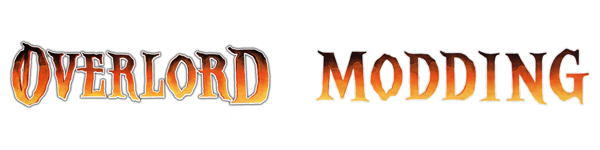

# Welcome to the Overlord Modding Repository

# Basic File Formats
 - incomplete list
 - [SPF](#SPF)
 - [PSP](#PSP)
 - [OSI](#OSI)
 - [OSG](#OSG)
 - [TZF](#TZF)
 - [MAP](#MAP)
 - [DTA](#DTA)
 - [PRP](#PRP)
 - [RPK](#RPK)
 - [CLB](#CLB)
 - [OMP](#OMP)
 - [8LD](#8LD)
 - [MP3](#MP3)
 - [DDS](#DDS)
 - [DAT](#DAT)
 - [XML](#XML)

# How to modify each file type

## XML

Extensible Markup Language File

While most good text editors like notepad++ can edit these directly, the developers specifically use microsoft excel 2003 spreadsheet xmls. you will either need excel, or libre office to create similar xmls.

## DAT

Open in a hex editor of your choice, do NOT use regular notepad as these files use NULL characters rather than space characters, and some have sizes written in bytes.

## DDS

Open the file in Paint.net or alternatively if you want to use GIMP there is a DDS plugin you can use. All images are DXT1, though the engine might be able to load higher quality images like DXT3, I simply havent tested it.

## MP3

Audacity can export mp3's as long as you have the LAME encoder for it, and many other audio software suites allow exporting in MP3 format. FFMPEG can also convert audio files to/from MP3 when needed. Virtually every audio player in existence can play back these files.

## 8LD

Language file of some sort

## OMP

Overlord Map Package

## CLB

Content Library
Aow3 ContentEd

## BIK

Bink Video Format

Proprietary video and audio format known for better compression rates at the time.

I will not be reverse engineering this, sorry.

## RPK

Resource Package
contains everything but the kitchen sink
 - categories and entries (contains lists of stuff 0/6 1/24 2/15 etc)
 - xmls
 - animations (ANIM)
 - effects (fx)
 - objects (OBJ)
 - meshes
 - materials (MAT)
 - texture (TEX - dds format)
 - LISTL (language?)
 - SFX (eventl?)

For the technicals of the format, please refer to the [included docs](./technical_specs/RPK.md)

## PRP

Protected Resource Package

For the technicals of the format, please refer to the [included docs](./technical_specs/PRP.md)

## DTA

Under Construction.

## MAP

Texture Set Mapping File

Under Construction.

## TZF

Trusted ZLIB File

TZF files are a file type for compression, the only modifications you can do is compressing or decompressing, both of which the tool provided inside this repository can do for you.
For the technicals of the format, please refer to the [included docs](./technical_specs/TZF.md).

## OSG

Overlord Save Game

## OSI

Overlord Save Info

## PSP

Protected System Package

## SPF

System Package File